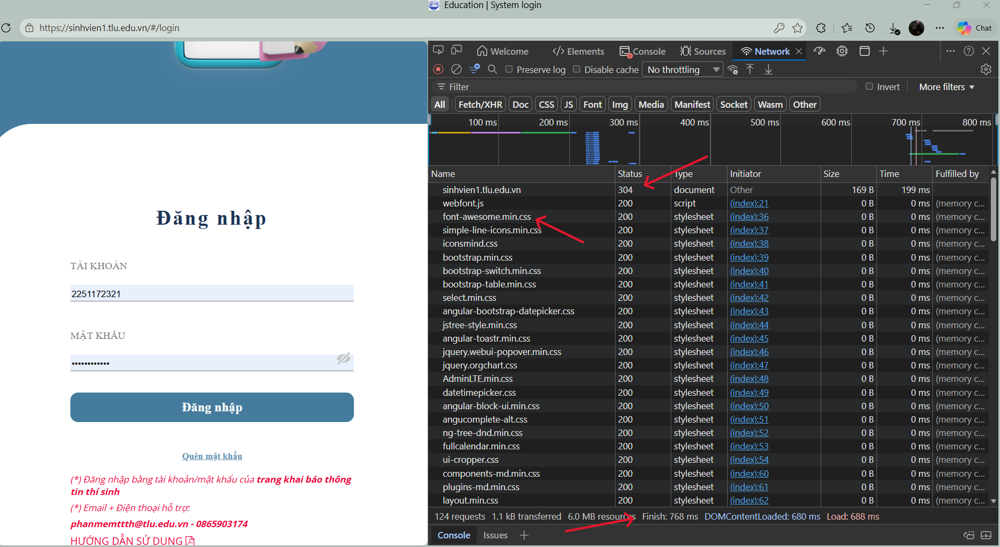

# Câu A1 - HTTP & Brower
1. Khi bạn gõ https://shopee.vn vào trình duyệt và nhấn Enter, hãy liệt kê đúng thứ tự ít nhất 5 bước xảy ra (từ DNS lookup đến render).
    - Bước 1: Trình duyệt sẽ dịch địa chỉ của https://shopee.vn thành địa chỉ IP để máy tính hiểu
    - Bước 2: Sau khi có địa chỉ, trình duyệt gửi một HTTP Request đến Server của Shopee
    - Bước 3: Server của Shopee nhận yêu cầu. Server sẽ tìm dữ liệu và chuẩn bị các file HTML/CSS/JS cần thiết.
    - Bước 4: Rồi Server sẽ gửi ngược lại HTTP Responese cho trình duyệt gồm các đoạn code HTML/CSS/JS
    - Bước 5: Trình duyệt sẽ đọc code và hiển thị giao diện hoàn chỉnh lên màn hình
    - Bước 6:
* Tài liệu: tuan_1_html5/01_introduction_html_universe.md - phần 1.Web hoạt động như thế nào?

2. Trong DevTools của Chrome, tab Network cho thấy thông tin gì? Hãy mở một trang web bất kỳ, chụp screenshot tab Network và đánh dấu (vẽ mũi tên/khoanh tròn) vào:
    - Status Code của request đầu tiên
    - Tổng thời gian load trang
    - Một request trả về file CSS
* Trong DevTools của Chrome, tab Network cho thấy requests/responses

* Tài liệu: tuan_1_html5/01_introduction_html_universe.md - phần 4.3 Developer Tools (F12) — "Kính hiển vi" cho website
---
# Câu A2 - Semantic HTML
Tại sao trang web dưới đây bị Google đánh giá SEO thấp? Liệt kê ít nhất 4 lỗi semantic và sửa lại.
```html
<div class="header">
    <div class="logo">ShopTLU</div>
    <div class="menu">
        <div><a href="/">Trang chủ</a></div>
        <div><a href="/products">Sản phẩm</a></div>
    </div>
</div>
<div class="main">
    <div class="product">
        <div class="title">iPhone 16 Pro</div>
        <div class="price">25.990.000đ</div>
        <div class="image"></div>
    </div>
</div>
<div class="footer">© 2026 ShopTLU</div>
```
* Trang web dưới đây bị Google đánh giá SEO thấp vì sử dụng toàn thẻ `<div>`, google không hiểu đâu là header, memu, main
* Các lỗi semantic trong đoạn code trên:
    - Sử dụng `<div class="header">`, `<div class="main">`, `<div class="footer">`
    - Sử dụng thẻ `<div>` lồng nhau cho menu
    - Tên sản phẩm để trong `<div class="title">`
    - `` thiếu thuộc tính
* Code sau khi sửa:
```html
<header>
    <div class="logo">ShopTLU</div>
    <nav>
        <ul>
            <li><a href="/">Trang chủ</a></li>
            <li><a href="/products">Sản phẩm</a></li>
        </ul>
    </nav>
</header>
<main>
    <article class="product">
        <h2>iPhone 16 Pro</h2>
        <p class="price">25.990.000đ</p>
        
    </article>
</main>
<footer><p>© 2026 ShopTLU</p></footer>
```
* Tài liệu: tuan_1_html5/04_visible_part_html.md
---
# Câu A3 - Block and Inline
* Không chạy code, hãy vẽ tay (hoặc mô tả bằng text art) kết quả hiển thị của đoạn HTML sau. Giải thích tại sao.
```html
<div>Hộp 1</div>
<span>Text A</span>
<span>Text B</span>
<div>Hộp 2</div>
<span>Text C</span>
<strong>Text D</strong>
<div>Hộp 3</div>
```
Kết quả: 

- Thẻ `<div>`: Nhóm nhiều phần lại, chiếm cả dòng, thuộc loại Block
- Thẻ '`<span>`: Không xuống dòng, không chiếm cả dòng, thuộc loại Inline
- Thẻ `<strong>`: Nhấn mạnh ngữ nghĩa, in đậm, thuộc loại Inline
* Tài liệu: tuan_1_html5/02_basic_structure_html.md
---
# Câu A4 - Table
* Giải thích sự khác nhau giữa `<thead>`, `<tbody>`, `<tfoot>`. Tại sao KHÔNG NÊN dùng table để tạo layout trang web? (Ghi rõ ít nhất 3 lý do)

|Thẻ|Vai trò|
|---|-------|
|`<thead>`|Đầu bảng chứa tiêu đề cột|
|`<tbody>`|Chứa nội dung chính|
|`<tfoot>`|Chứa nội dung tổng kết|

* Lý do KHÔNG NÊN dùng table để tạo layout trang web:
    - Semantic kém: Google nghĩ là đang làm bảng dữ liệu, không phải layout
    - Code rất khó bảo trì: Lồng nhiều `<tr>`, `<td>` -> rối code
    - Tải chậm hơn: Trình duyệt phải load xong bảng mới render
* Tài liệu: tuan_1_html5/05_tables_hyperlinks.md
---
# Câu C1 - Thiết kế cấu trúc
```html
<!DOCTYPE html>
<html lang="vi">
<head>
    <meta charset="UTF-8">
    <title>Chi tiết sản phẩm</title>
</head>
<body>
    <header> <!-- header: phần đầu trang, chứa menu -->
        <nav> <!-- nav: khu vực điều hướng chính -->
            <ul> <!-- ul/li: menu là danh sách --> 
                <li><a href="#">Trang chủ</a></li>
                <li><a href="#">Sản phẩm</a></li>
            </ul>
        </nav>
    </header>
    <main> <!-- main: nội dung chính của trang -->
        <nav aria-label="breadcrumb"> <!-- nav dùng cho breadcrumb -->
            <ul> <!-- ul/li: breadcrumb là danh sách có thứ tự -->
                <li><a href="#">Trang chủ</a></li>
                <li><a href="#">Điện thoại</a></li>
                <li>iPhone 16</li>
            </ul>
        </nav>
        <section class="product-detail"> <!-- section: nhóm nội dung chính sản phẩm -->
            <div class="product-container"> <!-- div: dùng layout chia 2 cột (ảnh + info) -->
                <section class="product-images"> <!-- section: khu vực ảnh sản phẩm -->
                    <figure> <!-- figure: nhóm ảnh -->
                         <!-- img: hiển thị ảnh -->
                    </figure>
                    <figure>
                        
                    </figure>
                    <figure>
                        
                    </figure>
                    <figure>
                        
                    </figure>
                    <figure>
                        
                    </figure>
                </section>
                <article class="product-info"> <!-- article: 1 sản phẩm là nội dung riêng -->
                    <h1>Tên sản phẩm</h1> <!-- h1: tiêu đề chính -->
                    <p class="price">Giá sản phẩm</p> <!-- p: đoạn văn bản -->
                    <section class="rating"> <!-- section: nhóm đánh giá -->
                        <span>5/5 sao</span> <!-- span: hiển thị sao (Inline) -->
                        <span>(100 đánh giá)</span>
                    </section>
                    <section class="description"> <!-- section: mô tả sản phẩm -->
                        <h2>Mô tả</h2>
                        <p>Mô tả sản phẩm...</p>
                    </section>
                </article>
            </div>
            <section class="specifications"> <!-- section: bảng thông số kỹ thuật -->
                <h2>Thông số kỹ thuật</h2>
                <table> <!-- table: dạng bảng -->
                    <thead> <!-- thead: tiêu đề bảng -->
                        <tr> <!-- tr: nội dung của hàng -->
                            <th>Thông số</th> <!-- th: ô nội dung-->
                            <th>Chi tiết</th>
                        </tr>
                    </thead>
                    <tbody> <!-- tbody: dữ liệu chính -->
                        <tr>
                            <td>Màn hình</td> <!-- td: ô dữ liệu -->
                            <td>...</td>
                        </tr>
                    </tbody>
                </table>
            </section>
            <section class="reviews"> <!-- section: đánh giá / bình luận -->
                <h2>Đánh giá</h2>
                <article class="review"> <!-- article: mỗi bình luận là 1 nội dung riêng -->
                    <p>Nội dung bình luận</p>
                </article>
            </section>
        </section>
        <aside class="related-products"> <!-- aside: nội dung phụ -->
            <h2>Sản phẩm tương tự</h2>
            <article class="product-item"> <!-- article: mỗi sản phẩm là 1 item -->
                <p>Tên sản phẩm</p>
            </article>
        </aside>
    </main>
    <footer> <!-- footer: phần cuối trang -->
        <p>© 2026 ShopTLU</p>
    </footer>
</body>
</html>
```
---
# Câu C2 - So sánh & Suy luận
* Một đồng nghiệp nói: "Dùng `<div>` cho mọi thứ rồi thêm class là được, không cần semantic HTML. Tốn thời gian học thêm thẻ mới."

* Viết 1 đoạn phản biện (200-300 từ), phải bao gồm:
    - Ít nhất 2 lý do kỹ thuật (SEO, Accessibility)
    - 1 ví dụ cụ thể chứng minh semantic HTML giúp ích
    - 1 trường hợp thực tế mà `<div> `vẫn phù hợp

Quan điểm của đồng nghiệp về kỹ thuật gây nhiều vấn đề lâu dài.
Thứ nhất là SEO. Khi dùng các thẻ semantic như `<header>`, `<main>`, `<footer>`, Google dễ xác định đâu là phần tiêu đề chính, đâu là phần nội dung. Nếu tất cả đều là `<div>`, khiến việc index kém hiệu quả hơn.
Thứ hai là Accessibility (khả năng truy cập). Người dùng dùng screen reader (người khiếm thị) phụ thuộc vào semantic HTML để điều hướng. Ví dụ, họ có thể nhảy nhanh đến `<nav>` hoặc `<main>`. Nếu chỉ dùng `<div>`, họ phải nghe toàn bộ trang, trải nghiệm rất tệ.
Ví dụ cụ thể: Một trang tin tức dùng `<article>` cho mỗi bài viết và `<h1>` cho tiêu đề. Screen reader có thể liệt kê tất cả bài viết và tiêu đề để người dùng chọn nhanh. Nếu dùng `<div>`, chức năng này gần như mất đi.
Tuy nhiên, `<div>` vẫn rất cần thiết trong thực tế. Nó phù hợp cho layout và styling khi không có ý nghĩa semantic rõ ràng.
Tóm lại: Semantic HTML giúp website dễ hiểu hơn cho máy tìm kiếm và con người, còn `<div>` nên dùng đúng chỗ thay vì thay thế tất cả.