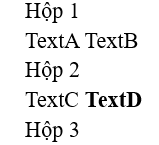

# Câu A1 - HTTP & Brower
1. Khi bạn gõ https://shopee.vn vào trình duyệt và nhấn Enter, hãy liệt kê đúng thứ tự ít nhất 5 bước xảy ra (từ DNS lookup đến render).
    - Bước 1: Trình duyệt sẽ dịch địa chỉ của https://shopee.vn thành địa chỉ IP để máy tính hiểu
    - Bước 2: Sau khi có địa chỉ, trình duyệt gửi một HTTP Request đến Server của Shopee
    - Bước 3: Server của Shopee nhận yêu cầu. Server sẽ tìm dữ liệu và chuẩn bị các file HTML/CSS/JS cần thiết.
    - Bước 4: Rồi Server sẽ gửi ngược lại HTTP Responese cho trình duyệt gồm các đoạn code HTML/CSS/JS
    - Bước 5: Trình duyệt sẽ đọc code và hiển thị giao diện hoàn chỉnh lên màn hình
    - Bước 6:
* Tài liệu: tuan_1_html5/01_introduction_html_universe.md - phần 1.Web hoạt động như thế nào?

2. Trong DevTools của Chrome, tab Network cho thấy thông tin gì? Hãy mở một trang web bất kỳ, chụp screenshot tab Network và đánh dấu (vẽ mũi tên/khoanh tròn) vào:
    - Status Code của request đầu tiên
    - Tổng thời gian load trang
    - Một request trả về file CSS
* Trong DevTools của Chrome, tab Network cho thấy requests/responses

* Tài liệu: tuan_1_html5/01_introduction_html_universe.md - phần 4.3 Developer Tools (F12) — "Kính hiển vi" cho website
---
# Câu A2 - Semantic HTML
Tại sao trang web dưới đây bị Google đánh giá SEO thấp? Liệt kê ít nhất 4 lỗi semantic và sửa lại.
```html
<div class="header">
    <div class="logo">ShopTLU</div>
    <div class="menu">
        <div><a href="/">Trang chủ</a></div>
        <div><a href="/products">Sản phẩm</a></div>
    </div>
</div>
<div class="main">
    <div class="product">
        <div class="title">iPhone 16 Pro</div>
        <div class="price">25.990.000đ</div>
        <div class="image"></div>
    </div>
</div>
<div class="footer">© 2026 ShopTLU</div>
```
* Trang web dưới đây bị Google đánh giá SEO thấp vì sử dụng toàn thẻ `<div>`, google không hiểu đâu là header, memu, main
* Các lỗi semantic trong đoạn code trên:
    - Sử dụng `<div class="header">`, `<div class="main">`, `<div class="footer">`
    - Sử dụng thẻ `<div>` lồng nhau cho menu
    - Tên sản phẩm để trong `<div class="title">`
    - `` thiếu thuộc tính
* Code sau khi sửa:
```html
<header>
    <div class="logo">ShopTLU</div>
    <nav>
        <ul>
            <li><a href="/">Trang chủ</a></li>
            <li><a href="/products">Sản phẩm</a></li>
        </ul>
    </nav>
</header>
<main>
    <article class="product">
        <h2>iPhone 16 Pro</h2>
        <p class="price">25.990.000đ</p>
        
    </article>
</main>
<footer><p>© 2026 ShopTLU</p></footer>
```
* Tài liệu: tuan_1_html5/04_visible_part_html.md
---
# Câu A3 - Block and Inline
* Không chạy code, hãy vẽ tay (hoặc mô tả bằng text art) kết quả hiển thị của đoạn HTML sau. Giải thích tại sao.
```html
<div>Hộp 1</div>
<span>Text A</span>
<span>Text B</span>
<div>Hộp 2</div>
<span>Text C</span>
<strong>Text D</strong>
<div>Hộp 3</div>
```
Kết quả: 

- Thẻ `<div>`: Nhóm nhiều phần lại, chiếm cả dòng, thuộc loại Block
- Thẻ '`<span>`: Không xuống dòng, không chiếm cả dòng, thuộc loại Inline
- Thẻ `<strong>`: Nhấn mạnh ngữ nghĩa, in đậm, thuộc loại Inline
* Tài liệu: tuan_1_html5/02_basic_structure_html.md
---
# Câu A4 - Table
* Giải thích sự khác nhau giữa `<thead>`, `<tbody>`, `<tfoot>`. Tại sao KHÔNG NÊN dùng table để tạo layout trang web? (Ghi rõ ít nhất 3 lý do)

|Thẻ|Vai trò|
|---|-------|
|`<thead>`|Đầu bảng chứa tiêu đề cột|
|`<tbody>`|Chứa nội dung chính|
|`<tfoot>`|Chứa nội dung tổng kết|

* Lý do KHÔNG NÊN dùng table để tạo layout trang web:
    - Semantic kém: Google nghĩ là đang làm bảng dữ liệu, không phải layout
    - Code rất khó bảo trì: Lồng nhiều `<tr>`, `<td>` -> rối code
    - Tải chậm hơn: Trình duyệt phải load xong bảng mới render
* Tài liệu: tuan_1_html5/05_tables_hyperlinks.md