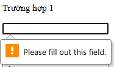
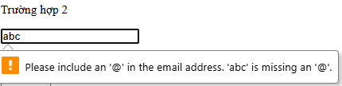
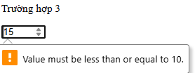
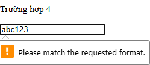
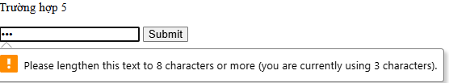

# Câu A1 — Input Types
1. `type="email"` → Ô nhập text, trình duyệt kiểm tra có dấu @ và đúng định dạng email → Dùng cho form đăng ký tài khoản / nhận hóa đơn
2. `type="password"` → Ô nhập nhưng ký tự bị ẩn (hiện dấu ●●●) → Không có validation mặc định → Dùng khi đăng nhập / tạo mật khẩu
3. `type="text"` → Ô nhập văn bản bình thường → Không có validation mặc định → Dùng nhập tên khách hàng, địa chỉ
4. `type="number"` → Ô nhập số, có nút tăng/giảm → Chỉ cho nhập số → Dùng nhập số lượng sản phẩm
5. `type="tel"` → Ô nhập số điện thoại → Gợi ý bàn phím số trên mobile → Dùng nhập số điện thoại giao hàng
6. `type="url"` → Ô nhập link → Kiểm tra có dạng URL  → Dùng nhập website 
7. `type="date"` → Hiển thị bộ chọn ngày → Kiểm tra đúng định dạng ngày → Dùng chọn ngày giao hàng
8. `type="radio"` → Nút chọn tròn chọn 1 trong nhiều lựa chọn → Không validation riêng → Dùng chọn phương thức thanh toán (COD / Visa)
9. `type="checkbox"` → Ô vuông tích chọn (có thể chọn nhiều) → Không validation riêng → Dùng chọn nhiều sản phẩm / đồng ý điều khoản
10. `type="file"` → Nút upload file → Có thể giới hạn loại file (accept) → Dùng upload ảnh (ví dụ feedback sản phẩm)

* Tài liệu tham chiếu: tuan_1_html5/07_forms_interactive.md -> Các Input Types HTML5
---
# Câu A2 — Validation Attributes
Không chạy code, hãy dự đoán điều gì xảy ra khi user bấm Submit cho mỗi trường hợp sau. Giải thích TẠI SAO.
```html
<!-- Trường hợp 1 -->
<input type="text" required value="">   <!-- User để trống -->

<!-- Trường hợp 2 -->
<input type="email" value="abc">        <!-- User gõ "abc" -->

<!-- Trường hợp 3 -->
<input type="number" min="1" max="10" value="15"> <!-- User gõ 15 -->

<!-- Trường hợp 4 -->
<input type="text" pattern="[0-9]{10}" value="abc123"> <!-- User gõ "abc123" -->

<!-- Trường hợp 5 -->
<input type="password" minlength="8" value="123">  <!-- User gõ "123" -->
```
- TH1->Form không submit: Có sự mâu thuẫn giữa `required`(bắt buộc nhập) và `value=""`(dể trống)
- TH2->Form không submit: Ở đây `type="email"` chỉ nhập `abc` thiếu `@` nên sẽ bị lỗi cú pháp
- TH3->Form không submit: Thấy `min="1"` và `max="10"` nghĩa là giá trị sẽ nằm trong đoạn từ 1-10, user nhập 15 vượt quá giới hạn max nên sẽ bị lỗi
- TH4->Form không submit: `pattern="[0-9]{10}"` là chỉ chứa số, đúng 10 chữ số, user nhập `abc123` vi phạm lỗi có chữ và không đủ 10 số
- TH5->Form không submit: `minlength="8"` nghĩa là tối tiểu là 8 ký tự nhưng user chỉ để là `123` ch có 3 ký tự sẽ vi phạm lỗi không đủ độ dài tối thiểu

* Sau khi thực hành đây là kết quả thực tế:
- TH1: 
- TH2: 
- TH3: 
- TH4: 
- TH5: 
* Tài liệu tham chiếu: tuan_1_html5/07_forms_interactive.md -> HTML5 Validation Attributes
---
# Câu A3 — Accessibility
1. Tại sao `<label for="email">` quan trọng cho người dùng screen reader?
- `<label>` giúp biết được với ô input này sẽ được dùng cho cái gì. Khi có `<label>` screen reader sẽ đọc được là `"Email, edit text"`, người khiếm thị sẽ biết được ô này được dùng để nhập Email. Nếu không có `<label>` thì screen reader chỉ đọc `"edit text"`, người khiếm thị sẽ không ô này để làm gì?
2. Khi nào dùng `<fieldset>` + `<legend>`? Cho ví dụ cụ thể.
- `<fieldset>` + `<legend>` được dùng khi: Nhóm nhiều input liên quan lại với nhau
- VÍ dụ:
```html
<fieldset>
  <legend>Giới tính</legend>

  <label>
    <input type="radio" name="gender" value="male"> Nam
  </label>

  <label>
    <input type="radio" name="gender" value="female"> Nữ
  </label>
</fieldset>
```
3. `aria-label` dùng khi nào? Tại sao KHÔNG nên dùng aria-label khi đã có `<label>`?
- `aria-label` được dùng khi: Không có `<label>` hiển thị nhưng vẫn cần mô tả
- Không nên dùng `aria-label` khi đã có `<label>` vì `aria-label` sẽ ghi đè `<label>` thật
### Tài liệu tham chiếu: tuan_1_html5/07_forms_interactive.md -> Accessibility — Form cho mọi người
---
# Câu A4 — Media
1. `loading="lazy"` trong `` là thuộc tính giúp trì hoãn việc tải ảnh cho đến khi ảnh đó sắp xuất hiện trong màn hình. Nó giúp Tăng tốc độ tải trang ban đầu, Cải thiện trải nghiệm người dùng, nhất là trên mobile mạng yếu. Không nên sủ dụng nó trong trường hợp: Ảnh quan trọng ở đầu trang, Ảnh cần hiển thị ngay lập tức để tránh layout bị “nhảy” (ảnh banner, ảnh sản phảm nổi bật, ảnh chính bài viết,...)
2. Nên cung cấp nhiều `<source>` trong thẻ `<video>` vì Trình duyệt sẽ tự chọn format nó hỗ trợ, giúp tăng khả năng tương thích-> Video chạy được trên nhiều thiết bị hơn (Chrome, Safari, Firefox,...). 3 format video web phổ biến: MP4, WebM, Ogg
3. Thuộc tính `alt` trên `` dùng để: cung cấp mô tả văn bản cho hình ảnh trong trường hợp hình ảnh không thể hiển thị hoặc cho các công cụ tìm kiếm và người dùng khiếm thị,
- Với Ảnh sản phẩm iPhone 16: `alt="iPhone 16 màu đen, màn hình 6.1 inch, thiết kế viền mỏng"`
- Với Ảnh trang trí: Không có nội dung gì -> `alt=""`
- Với Ảnh biểu đồ doanh thu: `alt="Biểu đồ doanh thu quý 1 năm 2026, tăng trưởng từ tháng 1 đến tháng 4"`
# Câu A5 — So sánh `<figure>` vs ``
```html
<!-- Cách 1 -->


<!-- Cách 2 -->
<figure>
    
    <figcaption>iPhone 16 Pro Max — 25.990.000đ</figcaption>
</figure>
```
#### Cách 1 dùng khi ảnh chỉ để hiển thị, không cần chú thích rõ ràng đi kèm. Gọn, đơn giản, không có caption, dùng cho icon, ảnh phụ.
Ví dụ 1: Ảnh thumbnail sản phẩm 
```html 

```
VÍ dụ 2: Icon trong giao diện 
```html 

```
#### Cách 2 dùng khi ảnh có ý nghĩa độc lập + cần chú thích đi kèm. Có figcaption mô tả rõ nội dung, tốt cho semantic, dùng khi ảnh là nội dung chính
Ví dụ 1: Trang chi tiết sản phẩm
```html 
<figure>
  
  <figcaption>iPhone 16 Pro Max — 25.990.000đ</figcaption>
</figure>
```
VÍ dụ 2: Blog review sản phẩm
```html 
<figure>
  
  <figcaption>Chất lượng ảnh chụp ban đêm từ iPhone 16</figcaption>
</figure>
```
---
# Câu C1 - Debug Form
Form dưới đây có 8 lỗi về validation, accessibility, và best practices. Tìm và sửa tất cả.
```html
<form>
    Tên: <input type="text">
    
    <input type="email" placeholder="Email của bạn">
    
    <input type="password" placeholder="Mật khẩu">
    <input type="password" placeholder="Nhập lại mật khẩu">
    
    Phone: <input type="text" value="0901234567">
    
    <select>
        <option>Hà Nội</option>
        <option>TP.HCM</option>
    </select>
    
    <label>
        Tôi đồng ý điều khoản
    </label>
    
    <input type="submit" value="Gửi">
</form>
```
1. Lỗi 1: Dòng 2: Input "Tên" không có `<label for="...">`, vi phạm accessibility
- Sửa: 
```html 
<label for="name">Tên:</label> 
<input type="text" id="name" name="name" required>
```
2. Lỗi 2: Dòng 4 — Input email không có `<label>` → Placeholder không thay thế label
- Sửa:
```html
<label for="email">Email:</label>
<input type="email" id="email" name="email" required>
```
3. Lỗi 3: Dòng 6 — Input password không có `<label>` → Người dùng không biết trường này là gì
- Sửa:
```html
<label for="password">Mật khẩu:</label>
<input type="password" id="password" name="password" required>
```
4. Lỗi 4: Dòng 7 — Input xác nhận mật khẩu không có `<label>` → Người dùng không biết trường này là gì
- Sửa:
```html
<label for="confirm">Nhập lại mật khẩu:</label>
<input type="password" id="confirm" name="confirm" required>
```
5. Lỗi 5: Dòng 9 — Phone dùng `type="text"` → Nên sử dụng `type = "tel"`
- Sửa:
```html
<label for="phone">Số điện thoại:</label>
<input type="tel" id="phone" name="phone" pattern="[0-9]{10}" required>
```
6. Lỗi 6: Dòng 11 — `<select>` không có label + thiếu value → Kém accessibility
- Sửa:
```html
<label for="city">Thành phố:</label>
<select id="city" name="city" required>
    <option value="">--Chọn--</option>
    <option value="hn">Hà Nội</option>
    <option value="hcm">TP.HCM</option>
</select>required>
```
7. Lỗi 7: Dòng 16 — Checkbox điều khoản bị thiếu `<input type="checkbox">`
- Sửa:
```html
<input type="checkbox" id="terms" name="terms" required>
<label for="terms">Tôi đồng ý điều khoản</label>
```
8. Lỗi 8: Dòng 9 — Dùng value mặc định cho số điện thoại
- Sửa:
```html
<input type="tel" id="phone" name="phone" required>
```
---
# CâuC2 - Thiết kế chiến lược Validation
#### Xây dựng form đăng ký cho ngân hàng số. Yêu cầu:
- CMND/CCCD: đúng 12 chữ số
- Số tài khoản: 10-15 chữ số
- Email: bắt buộc, đúng format
- PIN: đúng 6 chữ số, KHÔNG hiển thị

1. Viết `pattern` regex cho CMND/CCCD và Số tài khoản
- CMND/CCCD (đúng 12 chữ số): `pattern="^[0-9]{12}$"`
- Số tài khoản (10–15 chữ số): `pattern="^[0-9]{10,15}$"`
2. Giải thích: HTML5 validation đủ an toàn cho ứng dụng ngân hàng chưa? Tại sao?
HTML5 validation KHÔNG đủ an toàn cho ứng dụng ngân hàng. Vì:
- Chỉ chạy ở frontend
- Người dùng có thể:Tắt validation, sửa code HTML bằng DevTools
3. Liệt kê 3 loại validation mà HTML5 KHÔNG THỂ làm được (phải dùng JavaScript)
- So sánh giữa các trường: PIN nhập lại phải giống PIN ban đầu
- Nghiệp vụ phức tạp: Kiểm tra tuổi ≥ 18 từ ngày sinh
- Kiểm tra dữ liệu với server: Email đã tồn tại chưa, số tài khoản có hợp lệ trong hệ thống không
4. 2 rủi ro bảo mật nếu chỉ validate frontend
- Lách kiểm tra: Hacker gửi dữ liệu sai trực tiếp lên server
- Tấn công bảo mật: Hacker không chỉ gửi dữ liệu sai mà còn gửi cả dữ liệu có mã độc