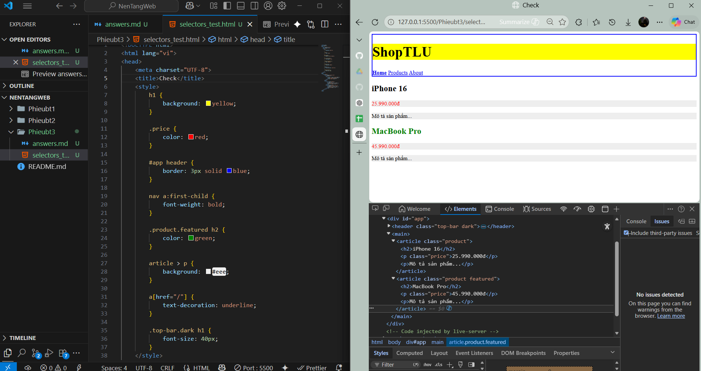
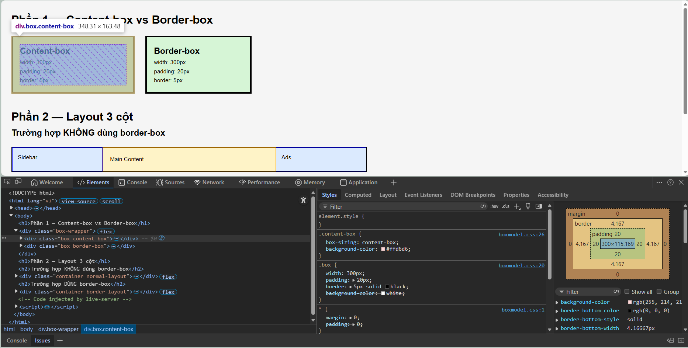
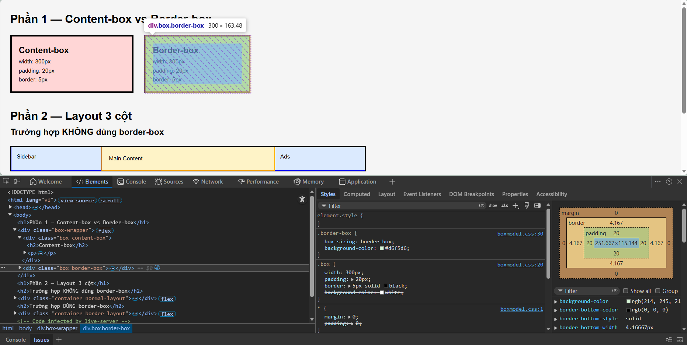
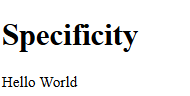

# Câu A1 - 3 cách nhúng CSS
Liệt kê 3 cách nhúng CSS vào HTML
1. Inline CSS: viết CSS trực tiếp ngay trong thẻ HTML bằng thuộc tính `style`.
```html
<p style="color: red; font-size: 20px;">Xin chào</p>
```
- Ưu điểm: Nhanh, đơn giản. Sửa trực tiếp ngay trên element
- Nhược điểm: Code bị rối nếu dùng nhiều, khó tái sử dụng và bảo trì khi website lớn
- Inline dùng khi: Test nhanh giao diện, chỉnh riêng 1 phần tử đặc biệt và debug CSS

2. Internal CSS: viết CSS bên trong thẻ `<style> `trong file HTML
```html
<!DOCTYPE html>
<html>
<head>
    <style>
        p {
            color: blue;
            font-size: 18px;
        }
    </style>
</head>
<body>
    <p>Xin chào</p>
</body>
</html>
```
- Ưu điểm: Dễ quản lý hơn inline, một CSS áp dụng cho nhiều phần tử và không cần file riêng
- Nhược điểm: File HTML sẽ dài nếu CSS nhiều và không tái sử dụng cho nhiều trang
- Internal dùng khi: Tạo website nhỏ, bài tập HTML/CSS

3. External CSS: viết CSS trong file riêng .css rồi liên kết bằng` <link>`
##### Ví dụ:
- File HTML
```html
<!DOCTYPE html>
<html>
<head>
    <link rel="stylesheet" href="style.css">
</head>
<body>
    <p>Xin chào</p>
</body>
</html>
```
- File style.css
```css
p {
    color: green;
    font-size: 22px;
}
```
- Ưu điểm: Code sạch, dễ quản lý, tái sử dụng cho nhiều trang và dễ bảo trì
- Nhược điểm: Cần tạo thêm file CSS. Nếu link sai thì CSS không hoạt động
- External dùng khi: Làm Website thật và dự án lớn, làm việc nhóm, FE chuyên nghiệp
#### Tài liệu tham chiếu: tuan_2_css_core/08_introduction_css.md → 3 cách thêm CSS
---
# Câu A2 - CSS Selectors
HTML đã cho:
```html
<div id="app">
    <header class="top-bar dark">
        <h1>ShopTLU</h1>
        <nav>
            <a href="/" class="active">Home</a>
            <a href="/products">Products</a>
            <a href="/about">About</a>
        </nav>
    </header>
    <main>
        <article class="product">
            <h2>iPhone 16</h2>
            <p class="price">25.990.000đ</p>
            <p>Mô tả sản phẩm...</p>
        </article>
        <article class="product featured">
            <h2>MacBook Pro</h2>
            <p class="price">45.990.000đ</p>
            <p>Mô tả sản phẩm...</p>
        </article>
    </main>
</div>
```
1. Selector `h1`: chọn tất cả các thẻ `<h1>` → Chọn: `<h1>ShopTLU</h1>`
-> ShopTLU 
2. Selector `.price`: chọn mọi element có class `price` → Chọn:`<p class="price">25.990.000đ</p>` và `<p class="price">45.990.000đ</p>`
->25.990.000đ và 45.990.000đ
3. Selector `#app header`: `#app` chọn element có id = "app", header bên trong `#app` → Chọn: `<header class="top-bar dark">`: ShopTLU, Home, Products, About
4. Selector `nav a:first-child`: chọn thẻ `<a>` và là con đầu tiên bên trogn `<nav>` → Chọn: `<a href="/" class="active">Home</a>`-> Nội dung: Home
5. Selector `.product.featured h2`: có cả 2 class product, featured và thẻ `<h2` trong class này> → Chọn: `<article class="product featured">` -> Macbook Pro
6. Selector `article > p`: chỉ chọn `p` là con trực tiếp của `article` 
→ Chọn: `<p class="price">25.990.000đ</p>`, `<p>Mô tả sản phẩm...</p>`, `<p class="price">45.990.000đ</p>`, `<p>Mô tả sản phẩm...</p>` -> 25.990.000đ, 45.990.000đ, Mô tả sản phẩm...
7. Selector `a[href="/"]`: chọn thẻ `<a>` có `href="/"` → Chọn: `<a href="/" class="active">Home</a>` -> Home
8. Selector `.top-bar.dark h1`: chọn element có class top-bar và dark rồi lấy thẻ `<h1>` bên trong đó → Chọn: `<h1>ShopTLU</h1>` -> ShopTLU

- Kết quả :

#### Tài liệu tham chiếu: tuan_2_css_core/09_css_selector.md
---
# Cấu A3 - Box Model
### Trường hợp 1 — content-box (mặc định)
```css
.box-1 {
    width: 400px;
    padding: 20px;
    border: 5px solid black;
    margin: 10px;
}
```
#### Công thức mặc định: `width = chỉ tính phần CONTENT`
#### Công thức thực tế browser render: `content + padding + border`
#### Tính toán: 
- Content: 400px 
- Padding: trái 20px,phải 20px -> tổng: 40px 
- Border: trái 5px, phải 5px -> tổng: 10px
- Chiều rộng hiển thị: 400 + 40 + 10 = 450px -> Chiều rộng hiển thị = 450px
- Không gian chiếm trên trang: Margin cũng tính vào khoảng không gian chiếm: margin trái + phải:
10 + 10 = 20px -> Không gian chiếm trên trang = 450 + 20 = 470px

### Trường hợp 2 — border-box
```css
.box-2 {
    box-sizing: border-box;
    width: 400px;
    padding: 20px;
    border: 5px solid black;
    margin: 10px;
}
```
- Với: `box-sizing: border-box;` thì width đã bao gồm: `content + padding + border`
- Chiều rộng hiển thị browser render đúng: 400px
#### Tính thực tế
- Padding ngang: 20 + 20 = 40px; Border ngang:5 + 5 = 10px -> Tổng: 50px
- Content thực: 400 - 50 = 350px
##### -> Kích thước content thực tế = 350px

#### Không gian chiếm trên trang
- Margin: 10 + 10 = 20px; 400 + 20 = 420px → Không gian chiếm trên trang = 420px

### Trường hợp 3 — Margin Collapse
```css
.box-a { margin-bottom: 25px; }
.box-b { margin-top: 40px; }
```
#### Khoảng cách thực tế
##### CSS Margin Collapse
- Margin dọc (vertical margin) của block elements có thể "gộp" lại. 
- Browser sẽ lấy: margin lớn hơn
- Kết quả: max(25, 40) = 40px → Khoảng cách giữa 2 box = 40px

##### Vì sao KHÔNG phải 65px?
Vì: margin-top và margin-bottom theo chiều dọc bị collapse. Browser không cộng 2 margin lại.

#### Nâng cao — Margin âm
```css
.box-a { margin-bottom: -10px; }
.box-b { margin-top: 40px; }
```
Theo công thức -> 40 + (-10) = 30px => Khoảng cách = 30px
#### Tài liệu tham chiếu: tuan_2_css_core/11_box_model.md
--- 
# Câu A4 - Specificity 
Cho các CSS rules sau cùng target 1 element `<p class="price" id="main-price">`:
```css
p { color: black; }                    /* Rule A */
.price { color: blue; }               /* Rule B */
#main-price { color: red; }           /* Rule C */
p.price { color: green; }             /* Rule D */
```
#### Độ ưu tiện
1. !important              
2. Inline styles          
3. Số ID selectors            
4. Số Class/Pseudo selectors  
5. Số kiểu selectors        
#### 1. Tính Specificity Score:
Form (a,b,c), với:
- a: id selector
- b: số class/pseudo
- c: số kiểu selector
#### Rule A: 
- ID :0
- class: 0
- Kiểu: 1
##### => (0,0,1)
#### Rule B: 
- ID :0
- class: 1
- Kiểu: 0
##### => (0,1,0)
#### Rule C: 
- ID :1
- class: 0
- Kiểu: 0
##### => (1,0,0)
#### Rule D: 
- ID :0
- class: 1
- Kiểu: 1
##### => (0,1,1)
#### 2. Element sẽ có màu gì? Giải thích
So sánh thì rule C có điểm ưu tiên là (1,0,0) là mạnh nhết->Rule C thắng -> element sẽ màu : red
#### 3. Nếu thêm `<p class="price" id="main-price" style="color: orange;">`, element có màu gì?
- Inline CSS có độ ưu tiêncao hơn selector -> màu hiển thị là : orange
#### 4. Nếu Rule A thêm !important, element có màu gì? Tại sao?
- `!important` là mạnh nhất dù rule C có id vẫn thua -> màu hiển thị: black
#### Tài liệu tham chiếu: tuan_2_css_core/10_inheritance_cascading.md -> Cascade
---
# Câu B1 - Style trang Profile
Trong file có các loại selector sau:
- Tag selector: body, header, footer, main, figure, img, table, th, td, thead, tbody, tr, a,...
- ID selector: #skills table
- Class selector: .active 
- Universal Selector (*): * { box-sizing: border-box; }
- Pseudo-classes: header nav ul, header nav ul li a ,...
---
# Câu B2 - Box Model Lab
## Phần 1 — Content-box vs Border-box
### Hộp 1 (content-box)
- width khai báo: 300px
- padding: 20px
- border: 5px
#### Chiều rộng thực tế: 300 + 20 + 20 + 5 + 5 = 350px
Chiều rộng thật đo bằng DevTool = 348.31px 


### Hộp 2 (border-box)
- width khai báo: 300px
- padding: 20px
- border: 5px
- box-sizing: border-box
#### Chiều rộng thực tế: Tổng luôn giữ đúng 300px.
Nghĩa là:
- content sẽ tự co nhỏ lại
- padding và border được tính bên trong width
#### => DevTools hiển thị khoảng 300px.
Chiều rộng thật đo bằng DevTool = 300px

## Khác biệt
### content-box
- Đây là chế độ mặc định của CSS.
- width chỉ tính phần content.
- Padding và border sẽ cộng thêm vào kích thước thật.
- Công thức: Total Width = content + padding trái + padding phải + border trái + border phải

### border-box
#### width bao gồm:
- content
- padding
- border
#### Nên tổng kích thước không bị tăng thêm. Border-box giúp layout dễ tính toán hơn và thường được dùng trong thực tế.

# Phần 2 — Layout 3 cột

## Trường hợp KHÔNG dùng border-box

Kích thước thực:

- Sidebar: 250 + 15 + 15 + 2 + 2 = 284px
- Content: 500 + 20 + 20 + 2 + 2 = 544px
- Ads: 250 + 15 + 15 + 2 + 2 = 284px
#### Tổng: 284 + 544 + 284 = 1112px => LỚN HƠN 1000px => Layout bị tràn.

## Trường hợp DÙNG border-box
Các cột:
- Sidebar = 250px
- Content = 500px
- Ads = 250px
#### Tổng: 250 + 500 + 250 = 1000px=> Layout vừa đúng container.

---
# Câu B3 — Specificity Battle
## 10 Rules + Specificity
1. `p` Specificity: 0,0,1
2. `.text` Specificity: 0,1,0
3. `.highlight` Specificity: 0,1,0
4. `p.text` Specificity: 0,1,1
5. `p.highlight` Specificity: 0,1,1
6. `.text.highlight` Specificity: 0,2,0
7. `#demo` Specificity: 1,0,0
8. `p#demo` Specificity: 1,0,1
9. `#demo.text` Specificity: 1,1,0
10. `p#demo.text.highlight` Specificity: 1,2,1
#### Element hiển thị cuối cùng là: Màu đen (black).

##### Vì rule: `p#demo.text.highlight` có specificity cao nhất là 1,2,1 nên thắng tất cả các rule khác.
#### Trường hợp specificity khác nhau thì kết quả sẽ không đổi.
Ví dụ:
- #demo vẫn thắng .text
- vì ID mạnh hơn class
#### Trường hợp specificity bằng nhau
Thứ tự sẽ ảnh hưởng.
Ví dụ:
```css
.text {
    color: blue;
}

.highlight {
    color: green;
}
```
- Hai rule đều có specificity: 0,1,0
- Rule viết SAU sẽ thắng.
- Nếu .highlight viết sau .text: => màu xanh lá.
- Nếu .text viết sau: => màu xanh dương.

