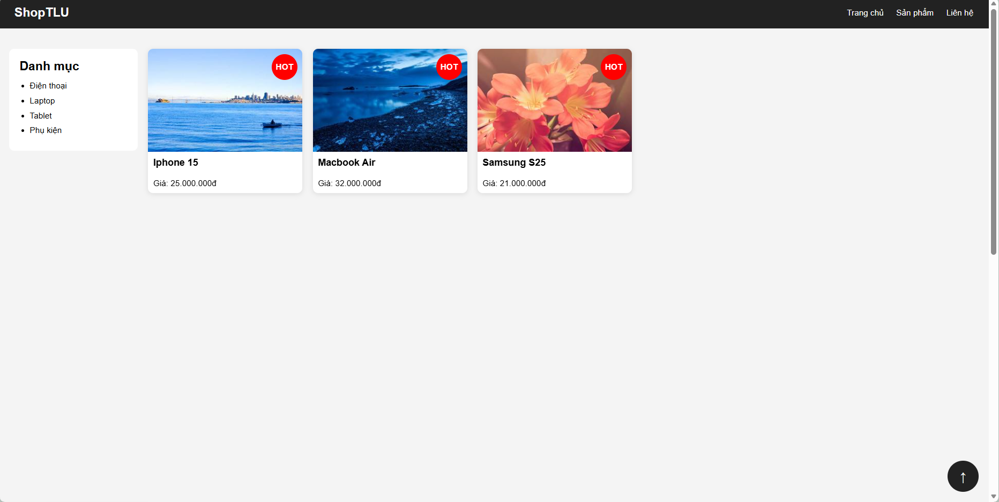
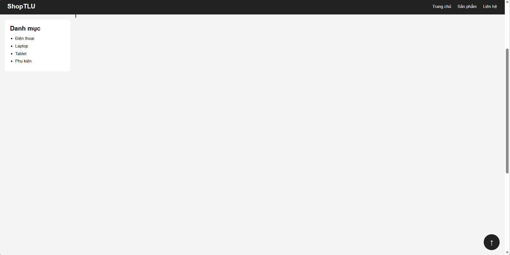
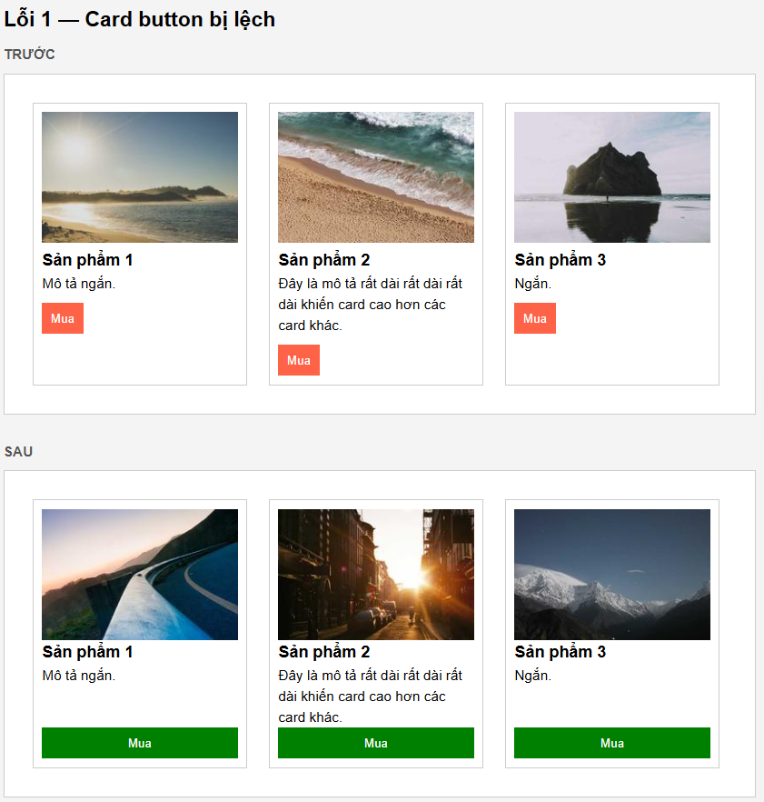
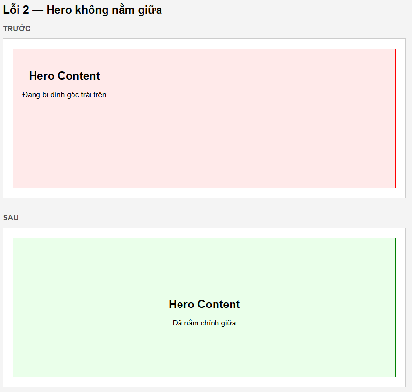
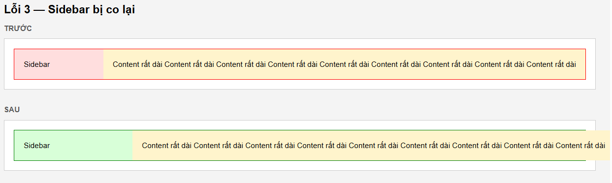

# Câu A1 — 5 Loại Positioning
| Position | Chiếm chỗ? | Tham chiếu vị trí | Cuốn theo trang? | Use case |
|---|---|---|---|---|
| `static` | Có | Không dùng top/left | Có | Mặc định |
| `relative` | Có | Chính nó | Có | Dịch nhẹ, làm mốc cho absolute |
| `absolute` | Không | Cha relative gần nhất | Có | Badge, dropdown, tooltip |
| `fixed` | Không | Viewport | Không | Chat button, modal overlay |
| `sticky` | Ban đầu có nhưng đến cuối thì không | Viewport (khi dính) | 1 phần: Cuộn đến ngưỡng thì dính | Sticky header, sidebar |
##### Tài liệu tham chiếu: tuan_2_css_core/12_css_positioning.md
---
# Câu A2 — Flexbox vs Grid
### Trường hợp 1:
```css
.container { display: flex; }
.item { flex: 1; }
/* 4 items → Bố cục = ??? */
```
- `display: flex` -> các item nằm ngang theo hàng
- `flex: 1` -> mọi item chia đều chiều rộng container

Có 4 item = 1 phần bằng nhau
#### Dự đoán
|  1  |  2  |  3  |  4  |
|-|-|-|-|


### Trường hợp 2:
```css
.container {
    display: flex;
    flex-wrap: wrap;
}
.item {
    width: 45%;
    margin: 2.5%;
}
```
- Mỗi item: 45% width + 2.5% left margin + 2.5% right margin = 50% -> 1 item chiếm khoảng 50% hàng
-  Mỗi hàng chứ được 2 items, có 6 items -> 3 hàng
#### Dự đoán:
|  1  |  2  | 
|-|-|
|  3  |  4  |
|  5  |  6  |

### Trường hợp 3:
```css
.container {
    display: flex;
    justify-content: space-between;
    align-items: center;
}
```
- `justify-content: space-between` (theo trục ngang): item đầu sát trái, item cuối sát phải, khoảng giữa chia đều
- `align-items: center` (theo trục dọc): các item căn giữa chiều cao container
#### Dự đoán:

|            |                   |                 |
|-|-|-|
|  [1]       |        [2]        |       [3]    |
|                                             |


### Trường hợp 4:
```css
.container {
    display: grid;
    grid-template-columns: 200px 1fr 200px;
    gap: 20px;
}
```
- grid có 3 cột: Cột 1 = 200px, Cột 2 = phần còn lại (1fr), Cột 3 = 200px
- `gap: 20px` -> khoảng cách giữ các cột
- Có 3 items: mỗi item vào 1 cột
#### Dự đoán:
||||
|-|-|-|
|--200px--|---item2---|--200px|     

### Trường hợp 5:
```css
.container {
    display: grid;
    grid-template-columns: repeat(3, 1fr);
    gap: 10px;
}
```
- `repeat(3, 1fr)` = 1fr 1fr 1fr
->grid có 3 cột bằng nhau
- Có 7 items thì chia hàng như sau: hàng 1(1,2,3), hangf2(4,5,6), hàng3(7)
#### Dự đoán:
|  1  |  2  | 3 |
|-|-|-|
|  4  |  5  | 6 |
|  7  |    |   |

##### Tài liệu tham chiếu: tuan_3_css_advance
---
# Câu B1:
- Đây là giao diện ban đầu:

- Đây là giao diện sau khi lướt xuống:

# Câu C1 - Flexbox vs Grid: Khi nào dùng gì?
| Tình huống | Nên dùng | Giai thích |
|------------|----------|------------|
| 1. Navigation bar ngang (logo + menu + buttons) | Flexbox | Navbar là layout 1 chiều (ngang). Flexbox rất mạnh để căn hàng ngang, spacing, align center |
| 2. Lưới ảnh Instagram (3 cột đều nhau, số ảnh không biết trước) | Grid | Đây là layout 2 chiều (hàng + cột). Grid giúp tạo các cột đều nhau dễ dàng |
| 3. Layout blog: main content + sidebar | Grid | Có cấu trúc rõ ràng theo cột: content lớn + sidebar nhỏ. Grid phù hợp cho layout trang tổng thể |
| 4. Footer với 4 cột thông tin (Về chúng tôi, Liên kết, Hỗ trợ, Liên hệ) | Grid hoặc Flexbox | Nếu chỉ cần chia 4 cột đơn giản → Flexbox được. Nếu muốn kiểm soát hàng/cột tốt hơn → Grid tốt hơn |
| 5. Card sản phẩm (ảnh trên, text giữa, nút dưới — nút luôn dính đáy) | Kết hợp cả hai | Grid/Flex để bố trí danh sách card; bên trong card dùng Flexbox theo cột để nút luôn dính đáy |
---
# Câu C2 - Debug Flexbox
### Lỗi 1: Cards không đều chiều cao — nút "Mua" bị nhảy lên/xuống
```css
.card-container { display: flex; flex-wrap: wrap; }
.card { width: 30%; margin: 1.5%; }
.card img { width: 100%; }
.card h3 { font-size: 18px; }
.card .btn { padding: 10px; }
```
#### Nguyên nhân:
- `.card` chưa dùng Flexbox theo cột.
- Nút `.btn` đang nằm ngay sau nội dung: nội dùng dài thì nút bị đẩy xuống và ngược lại
#### Cách sửa"
```css
.card-container {display: flex;flex-wrap: wrap;}
.card {width: 30%;margin: 1.5%;display: flex;flex-direction: column;}
.card img {width: 100%;}
.card h3 {font-size: 18px;}
.card .btn {padding: 10px;margin-top: auto;}
```
#### Kết quả: 

### Lỗi 2: Muốn items nằm giữa cả ngang lẫn dọc trong container 100vh, nhưng item vẫn dính góc trái trên
```css
.hero {
    height: 100vh;
    display: flex;
}
.hero-content {
    text-align: center;
}
```
#### Nguyên nhân:
- Container `.hero` có: `display: flex;` nhưng chưa căn ngang dọc
- Mặc định Flexbox là `justify-content: flex-start`
`align-items: stretch`
#### Cách sửa"
```css
.hero {
    height: 100vh;
    display: flex;
    justify-content: center;
    align-items: center;
}
.hero-content {text-align: center;}
```
#### Kết quả: 
### Lỗi 3: Sidebar bị co lại khi content quá dài
```css
.layout { display: flex; }
.sidebar { width: 250px; }
.content { flex: 1; }
```
#### Nguyên nhân:
- Trong Flexbox mặc định item có `flex-shrink: 1;` nghĩa là được phép co lại khi thiếu chỗ
- Sidebar có `width: 250px;` nhưng width không đảm bảo không co trong Flexbox
#### Cách sửa"
```css
.layout {display: flex;}
.sidebar {width: 250px;flex-shrink: 0;}
.content {flex: 1;}
```
#### Kết quả: 

# Câu D-Video
link: https://drive.google.com/drive/u/0/folders/1BCKjT6CJm6Mm8TLHa_9kToKog42KpMU6