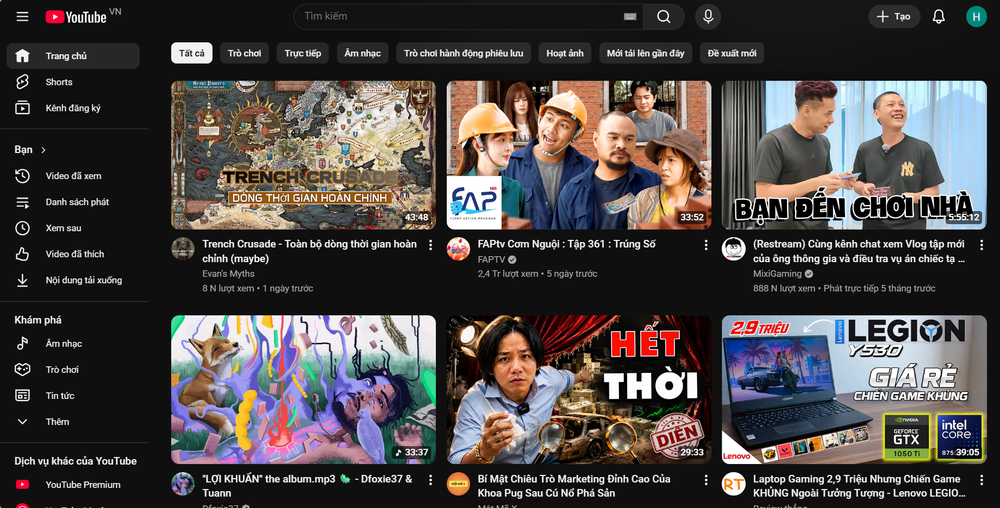
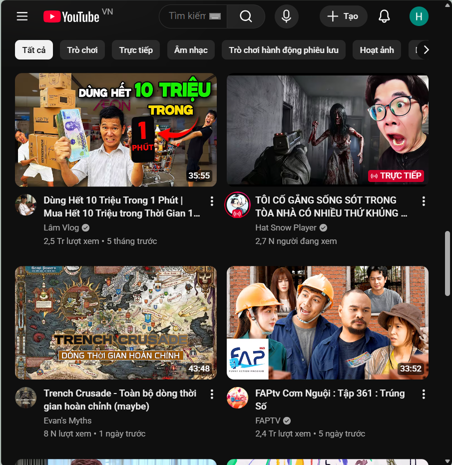

# Câu A1 — Viewport & Mobile-First
### Thẻ `<meta viewport>` chuẩn
```html
<meta name="viewport" content="width=device-width, initial-scale=1.0">
```
### Giải thích từng thuộc tính
- `width=device-width` là: Chiều rộng website = chiều rộng thật của thiết bị
- `initial-scale=1.0` là: Mức zoom ban đầu = 100%
### Nếu thiếu meta viewport?
- iPhone sẽ giả định: website desktop ~980px

Sau đó:
- tự zoom nhỏ toàn bộ trang
- chữ rất bé
- layout không responsive đúng

Dẫn đến:
- website bị thu nhỏ
- phải zoom tay
- có thể xuất hiện scroll ngang

### Mobile-First vs Desktop-First

1. Mobile-First
#### Ý tưởng: Viết CSS cho mobile trước, sau đó mở rộng dần.
Dùng:
```css
min-width
```
#### Ví dụ
```css
.card{width:100%;}
/* Tablet trở lên */
@media (min-width:768px){
    .card{width:50%;}
}
```
#### Hoạt động
```text
Mobile:100%
>=768px:50%
```
2. Desktop-First
#### Ý tưởng: Viết desktop trước, sau đó thu nhỏ xuống mobile.
Dùng:`max-width`
#### Ví dụ
```css
.card{width:50%;}
/* Mobile */
@media (max-width:768px){
    .card{width:100%;}
}
```
### Vì sao Mobile-First được khuyên dùng?

1. Người dùng hiện nay chủ yếu dùng: điện thoại, tablet
2. Mobile tải: ít CSS hơn, layout đơn giản hơn
3. Dễ mở rộng từ nhỏ → lớn hơn là thu nhỏ từ lớn → nhỏ
4. Google ưu tiên Mobile-First indexing -> SEO tốt hơn.

Tài liệu tham chiếu: tuan_3_css_advanced/13_creating_responsive_layouts.md

# Câu A2 — Breakpoints

| Breakpoint | Pixel | Thiết bị | Ví dụ lưới sản phẩm |
|---|---|---|---|
| Extra Small | `<576px` | Điện thoại nhỏ | 1 cột |
| Small | `≥576px` | Điện thoại lớn | 2 cột |
| Medium | `≥768px` | Tablet | 2-3 cột |
| Large | `≥992px` | Laptop | 3-4 cột |
| Extra Large | `≥1200px` | Desktop lớn | 4 cột |
| XXL | `≥1400px` | Màn hình rất lớn | 5-6 cột |

# Câu A3 — Media Queries

CSS:

```css
.container { width: 100%; padding: 10px; }

@media (min-width: 576px) {.container { width: 540px; }}
@media (min-width: 768px) {.container { width: 720px; }}
@media (min-width: 992px) {.container { width: 960px; }}
@media (min-width: 1200px) {.container { width: 1140px; }}
```
### Bảng kết quả
| Chiều rộng màn hình | `.container width` |
|---|---|
| 375px (iPhone SE) | 100% |
| 600px | 540px |
| 800px | 720px |
| 1000px | 960px |
| 1400px | 1140px |

# Câu A4 — SCSS Basics
### 1. Variables
#### Dùng để: lưu màu, font, spacing và giá trị dùng nhiều lần
#### Ví dụ
```scss
$primary-color: blue;
button {background:$primary-color; }
```
Đổi `$primary-color` -> đổi toàn bộ project
### 2. Nesting
Cho phép viết CSS lồng nhau.
#### Ví dụ
```scss
nav{
    ul{display:flex;}
    li{list-style:none;}
    a{color:white;}
}
```
#### CSS compile ra
```css
nav ul{}
nav li{}
nav a{}
```
#### Code: gọn hơn, dễ đọc hơn
### 3. Mixins
Giống function trong CSS.
#### Ví dụ
```scss
@mixin flexCenter{
    display:flex;
    justify-content:center;
    align-items:center;
}
.box{ @include flexCenter; }
```
#### Compile ra
```css
.box{
    display:flex;
    justify-content:center;
    align-items:center;
}
```

Tránh lặp code.
### 4. @extend / Inheritance
Cho class kế thừa style.
#### Ví dụ
```scss
.button{
    padding:10px;
    border-radius:5px;
}
.primary-btn{
    @extend .button;
    background:blue;
}
```
#### Kết quả
`.primary-btn` sẽ có: padding, border-radius từ `.button`

### Trình duyệt không đọc được `.scss`
Vì:
- SCSS không phải CSS chuẩn
- Browser chỉ hiểu: .css
#### Chuyển từ SCSS -> CSS

Sử dụng công cụ compile như :
- VS Code: Cài extension "Live Sass Compiler" -> Click "Watch Sass" -> Tự compile!
- Dự án thực tế: Webpack/Vite tự xử lý (React/Vue đã tích hợp sẵn)

Tài liệu tham chiếu: tuan_3_css_advanced/16_sass_scss.md
---
# Bài C1 — Phân tích trang web thực
Trang web được sử dụng là https://www.youtube.com
- Dạng desktop 

- Dạng tablet

- Dạng mobile


### Desktop 
- Hiển thị sẵn sidebar bên trái 
- Hamburger icon khi nhấn vào sẽ ẩn, hiện thanh sidebar 
- navbar lọc nằm ngang dưới ô tìm kiếm
- Lưới content 3 items 1 hàng
### Tablet
- Không còn hiện sẵn sidebar bên trái
- Font size nhỏ hơn
- Lưới content 2 items 1 hàng
- Hamburger icon khi bấm vào thanh sidebar sẽ có hiệu ứng lướt ra, lướt về
### Mobile
- Không còn hiện sẵn sidebar bên trái
- Font size nhỏ hơn
- Lưới content chỉ còn 1 items 1 hàng
- navbar lọc nằm ngang dưới ô tìm kiếm đã biến mất
- Hamburger icon khi bấm vào thanh sidebar sẽ có hiệu ứng lướt ra, lướt

Trong youtube em không tìm thấy bất kỳ `@media` nào cả 

# Bài C2 — Thiết kế Responsive Strategy

### 1. Mobile Layout (<768px)
#### Wireframe
```text
┌──────────────────────┐
│ LOGO      ☰ MENU     │
│ Phone: 0123 456 789  │
├──────────────────────┤
│                      │
│     HERO IMAGE       │
│                      │
├──────────────────────┤
│     FOOD IMAGE 1     │
├──────────────────────┤
│     FOOD IMAGE 2     │
├──────────────────────┤
│     FOOD IMAGE 3     │
├──────────────────────┤
│     FOOD IMAGE 4     │
├──────────────────────┤
│     FOOD IMAGE 5     │
├──────────────────────┤
│     FOOD IMAGE 6     │
├──────────────────────┤
│     BOOKING FORM     │
│  Date                │
│  Time                │
│  Guests              │
│  Notes               │
│  [BOOK NOW]          │
├──────────────────────┤
│    GOOGLE MAPS       │
├──────────────────────┤
│       FOOTER         │
└──────────────────────┘
```
#### Những cái bị ẩn
- Navigation menu đầy đủ
- Chỉ hiện hamburger ☰
- Một số text phụ có thể bị ẩn
#### Form nằm dưới grid ảnh vì:
- mobile ưu tiên cuộn dọc
- dễ thao tác bằng ngón tay
### 2. Tablet Layout (768px–1023px)
#### Wireframe
```text
┌────────────────────────────────┐
│ LOGO      MENU       PHONE     │
├────────────────────────────────┤
│                                │
│          HERO IMAGE            │
│                                │
├────────────────────────────────┤
│   IMG1    │    IMG2            │
├───────────┼────────────────────┤
│   IMG3    │    IMG4            │
├───────────┼────────────────────┤
│   IMG5    │    IMG6            │
├────────────────────────────────┤
│        BOOKING FORM            │
├────────────────────────────────┤
│         GOOGLE MAPS            │
├────────────────────────────────┤
│            FOOTER              │
└────────────────────────────────┘
```
#### Grid ảnh có 2 cột vì tablet rộng hơn mobile.
#### Bản đồ nằm dưới form đặt bàn

### 3. Desktop Layout (≥1024px)
#### Wireframe
```text
┌──────────────────────────────────────────────┐
│ LOGO      NAVIGATION           PHONE         │
├──────────────────────────────────────────────┤
│                                              │
│                HERO IMAGE                    │
│                                              │
├───────────────────┬──────────────────────────┤
│                   │                          │
│   FOOD GRID       │      BOOKING FORM        │
│   3 COLUMNS       │                          │
│                   │                          │
│                   │                          │
├───────────────────┴──────────────────────────┤
│                GOOGLE MAPS                   │
├──────────────────────────────────────────────┤
│                   FOOTER                     │
└──────────────────────────────────────────────┘
```
#### Layout có 2 cột chính
- trái: danh sách thức ăn trưng bày
- phải: booking form
#### Sidebar không cần sidebar riêng. Booking form đóng vai trò như sidebar phải.

### CSS Skeleton (Mobile-First)
```css
*{
    margin:0;
    padding:0;
    box-sizing:border-box;
}
body{
    font-family:Arial, sans-serif;
}

.header{
    display:flex;
    justify-content:space-between;
    align-items:center;
    padding:16px;
}

.hero{ height:300px; }

.food-grid{
    display:grid;
    grid-template-columns:1fr;
    gap:16px;
    padding:16px;
}

.booking-form{
    padding:16px;
    display:flex;
    flex-direction:column;
    gap:12px;
}

.map{ padding:16px; }

.footer{
    padding:20px;
    text-align:center;
}

@media (min-width:768px){
    .food-grid{
        grid-template-columns: repeat(2, 1fr);
    }
    .hero{ height:400px; }
}

@media (min-width:1024px){
    .main-layout{
        display:grid;
        grid-template-columns: 2fr 1fr;
        gap:32px;
        padding:32px;
    }
    .food-grid{
        grid-template-columns: repeat(3, 1fr);
    }
    .hero{
        height:500px;
    }
}
```
# Câu D - Video demo
https://drive.google.com/drive/u/0/folders/1BCKjT6CJm6Mm8TLHa_9kToKog42KpMU6
